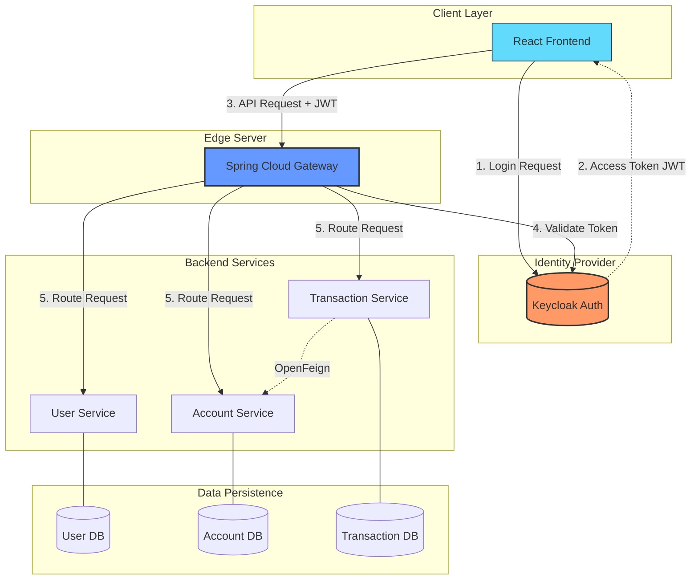

# 🏦 Bank Application – Microservices Architecture with Keycloak

A cloud-ready banking backend system built with **Spring Boot microservices**, secured using **Keycloak (OAuth2 / OpenID Connect)** and exposed through a **Spring Cloud Gateway**.

The system demonstrates centralized authentication, role-based authorization, inter-service communication, and API gateway patterns in a real-world microservices setup.

---

## 🧱 Architecture Overview

## Authentication & Authorization (Keycloak)

Keycloak acts as the Identity Provider (IdP). The authentication flow is as follows:

1. Client authenticates via Keycloak and receives a **JWT Access Token**.
2. Client sends requests to the Gateway with  
   `Authorization: Bearer <token>` header.
3. Gateway validates the JWT using Keycloak’s **JWK endpoint**.
4. Roles are extracted and converted into **Spring Security authorities**.
5. Authorized requests are routed to the respective backend microservices.

---

## 🧩 Services Breakdown

### 👤 User Service (`user-service`)

Responsible for user management and authentication-related logic.

**Features**
- User registration
- Profile retrieval
- Spring Security integration

**Tech**
- Spring Boot
- Spring Security
- JWT
- PostgreSQL

---

### 💳 Account Service (`account-service`)

Manages bank accounts and balances.

**Features**
- Account creation
- Balance management
- Inter-service communication via OpenFeign

**Tech**
- Spring Data JPA
- OpenFeign
- PostgreSQL

---

### 💸 Transaction Service (`transaction-service`)

Handles money transfers and transaction history.

**Features**
- Transaction persistence
- OpenFeign-based communication
- Fallback handling with Resilience4j

**Tech**
- Spring Data JPA
- OpenFeign
- Resilience4j
- PostgreSQL

---

### 🚪 Gateway Server (`gateway-server`)

Single entry point for all client requests.

**Features**
- JWT validation
- Role-Based Access Control (RBAC)
- Circuit Breaker support

**Tech**
- Spring Cloud Gateway
- OAuth2 Resource Server
- Resilience4j

---

## 🗄️ Database Design

| Service             | Database Name | Purpose                    |
|---------------------|---------------|----------------------------|
| User Service        | userdb        | Credentials & Profiles     |
| Account Service     | accountdb     | Balances & Account Info    |
| Transaction Service | transactiondb | Transfer History           |

---

## ⚙️ Tech Stack

### Language & Frameworks
- Java 21
- Spring Boot 3.4.x

### Security
- Keycloak
- OAuth2
- OpenID Connect

### Cloud & Communication
- Spring Cloud Gateway
- OpenFeign
- Resilience4j

### Persistence
- PostgreSQL
- Hibernate / JPA

### Build Tool
- Maven

---

## 🚀 Running the Project

### Prerequisites
- Java 21
- Maven
- PostgreSQL
- Keycloak (Realm: `bank-app`)

### Steps
Clone the repo:

Bash

git clone [https://github.com/burakerdgn1/bank-app.git](https://github.com/burakerdgn1/bank-app.git)
Start Services (in order):

gateway-server (Port 8080)

user-service

account-service

transaction-service

### 📌 Notes

All services are secured via Keycloak JWT-based authentication.

Inter-service communication is handled using OpenFeign.

The Gateway enforces centralized security and routing.
